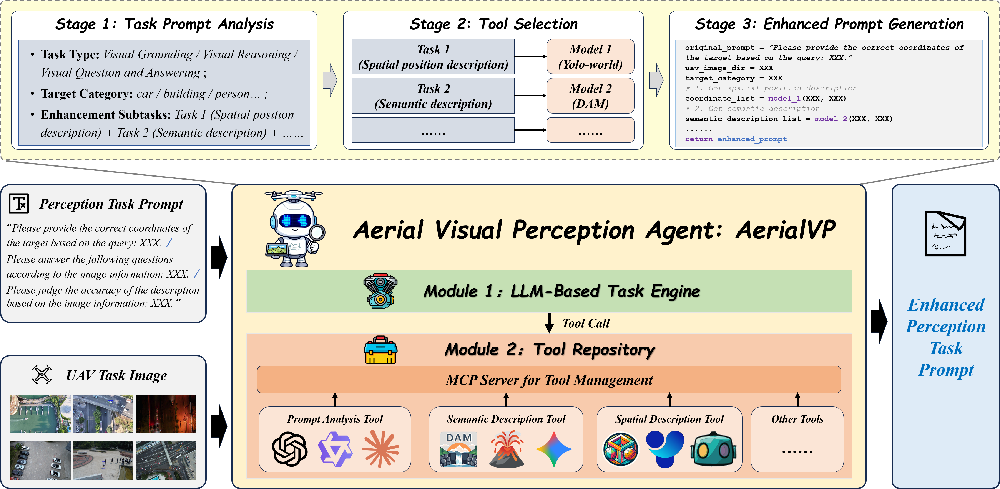

# AerialVP: Towards Accurate UAV Image Perception——Guiding Vision-Language Models with Stronger Task Prompts
This project introduces **AerialVP (Aerial Visual Perception)**, an agent framework that **automatically enhances task prompts** for UAV image understanding with Vision-Language Models (VLMs). AerialVP analyzes the input task, selects suitable tools from a modular repository, and generates **refined, information-enriched prompts** to support perception, reasoning, and grounding in aerial imagery. The project also provides **AerialSense**, a unified benchmark suite covering **Aerial Visual Reasoning**, **Aerial Visual Question Answering**, and **Aerial Visual Grounding**, enabling standardized evaluation across diverse UAV scenarios.

  

# 📦 AerialSense Dataset

**AerialSense** is a large-scale UAV perception benchmark curated from multiple public UAV sources and organized under a unified evaluation protocol. It is designed to support **comprehensive, diverse, and realistic** assessment of multimodal perception in aerial settings.

### 🧭 Multi-Task Coverage
AerialSense jointly supports three core UAV perception tasks within a single benchmark:
* 🧠 **Aerial Visual Reasoning (AVR)**
* ❓ **Aerial Visual Question Answering (AVQA)**
* 🎯 **Aerial Visual Grounding (AVG)**

### 📊 Scale & Density
* 🖼️ **7,119** UAV images
* 🧪 **53,374** task samples
  This high task density enables stable and systematic evaluation across multiple capabilities.

### 🧩 Rich Annotations for Grounding
For grounding-oriented evaluation, AerialSense includes **fine-grained referring expressions** paired with object localization annotations, emphasizing:
* 🎨 **semantic attributes** (e.g., color, category)
* 📍 **spatial cues** (e.g., orientation/relative position)
* 🔗 **relational descriptions** (e.g., “next to”, “in front of”)

### 🏷️ Broad Object & Scene Diversity
AerialSense covers **40 object categories** and diverse target types, including:
* 🚗🚶 **terrestrial moving objects** (cars, pedestrians)
* 🏢🅿️ **stationary structures/regions** (buildings, parking lots)
* 🚢 **waterborne moving objects** (ships)
  It supports evaluation across **terrestrial and aquatic scenes** with varied operational contexts.

### 🛰️ Multi-Resolution UAV Imagery
AerialSense includes images spanning a wide resolution range (approximately **512×512 to 4000×2250**), enabling robust testing of:
* 🔎 **multi-scale perception**
* 📷 **detail-sensitive recognition and localization**

### 📝 Instruction Richness
Task instructions are designed to be **information-rich and reasoning-oriented**, with an average length of **20.76 words** and substantial coverage of:
* object attributes
* spatial relations
* functional states
  This encourages deeper language–vision alignment beyond short keyword-style prompts.

### 🌦️ Realistic Visual Variations
To reflect real UAV conditions, AerialSense incorporates broad visual variation in:
* 💡 illumination
* 🧩 scene complexity
* 🛰️ resolution
  supporting fair evaluation of model adaptability and generalization in real-world aerial perception.

  

